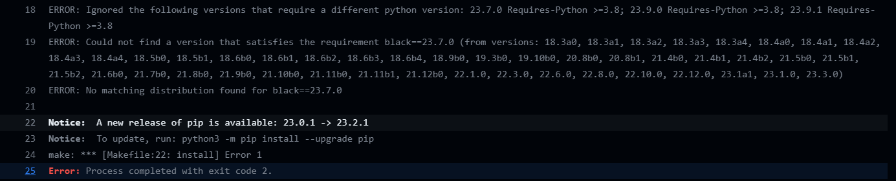

## Matrix Build Details:
By executing a matrix CI workflow, we can identify that python 3.7 is incompatible with this project explicitly because the Black formatter is incompatible with versions of python earlier than 3.8:

We also execute a build on MacOS and Ubuntu. By attempting a matrix build on Windows we see that it is incompatible both with Make files and the bash commands in our Makefile which are executed by our respective yml files. This can be circumvented by having a separate yml for Windows builds with interpretable command line entries for that OS. This reduces the efficacy of automation for our project however, since we lose automated quality control having two yml scripts for different OS's with distinct commands. That is a topic for further inquirey but for now, windows deployment for python projects should be well considered with this issue in mind.

## This is a workflow for a python script which performs descriptive statistics on a csv file
### This project has the following dependencies:
* ruff == 0.0.278
* pytest == 7.4.2
* black == 23.7.0
* pandas == 2.0.3
* nbval == 0.10.0
* matplotlib == 3.7.2
* jupyter == 1.0.0
* tabulate == 0.9.0

### This project uses has functions defined in a lib.py for reading a csv and generating summary statistics (with appropriate error handling) and a script with associated jupyter notebook for visualizing that data.

### This workflow will perform the following actions on any push to a branch in this repository:
* Establish a virtual environment for python3
* Install the dependencies listed above
* Lint the pushed code with ruff
* Format with black
* Perform a series of tests including verifying csv input and verifying descriptive statistics output

### Below is the output from the script/jupyter notebook which gives the count,mean,std,min, quartiles, and max for each variable:
|       |      mpg |   cylinders |   displacement |   weight |   acceleration |    year |     origin |
|:------|---------:|------------:|---------------:|---------:|---------------:|--------:|-----------:|
| count | 397      |   397       |        397     |  397     |       397      | 397     | 397        |
| mean  |  23.5159 |     5.45844 |        193.533 | 2970.26  |        15.5557 |  75.995 |   1.57431  |
| std   |   7.8258 |     1.70158 |        104.38  |  847.904 |         2.75   |   3.69  |   0.802549 |
| min   |   9      |     3       |         68     | 1613     |         8      |  70     |   1        |
| 25%   |  17.5    |     4       |        104     | 2223     |        13.8    |  73     |   1        |
| 50%   |  23      |     4       |        146     | 2800     |        15.5    |  76     |   1        |
| 75%   |  29      |     8       |        262     | 3609     |        17.1    |  79     |   2        |
| max   |  46.6    |     8       |        455     | 5140     |        24.8    |  82     |   3        |

### Below is the result of the visualize function from the script which plots vehicle weight against mpg. These images are saved into a figures directory with the lib defined save_plot() function. 

### This is the front end of a potential CD pipeline which will quality control continuously developed code into a deployment environment. Future iterations will build on this baseline best practice and scale into projects of higher complexity. This structure can be used to rapidly develop and quality control data science projects of much higher complexity.

